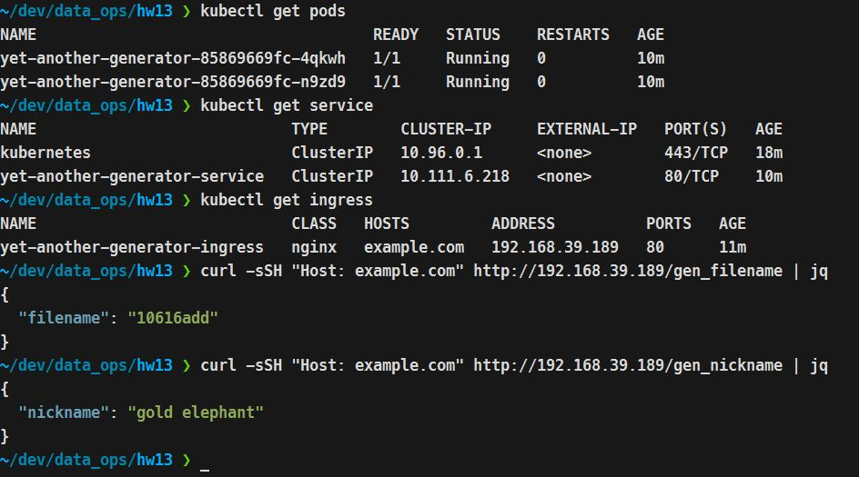

## Вариант 2
```
minikube start --vm-driver=kvm2 --memory=4096mb --cpus=4
minikube addons enable ingress
kubectl apply -f deployment.yaml
kubectl apply -f service.yaml
kubectl apply -f ingress.yaml
```
