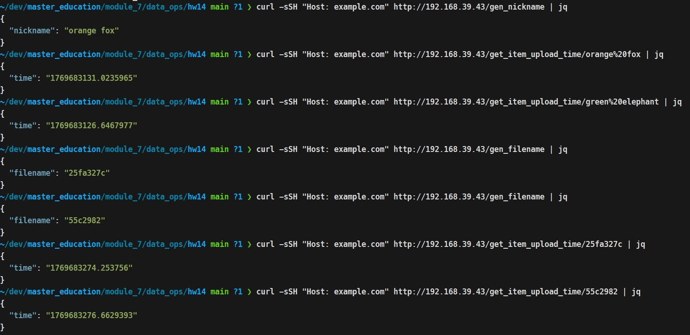
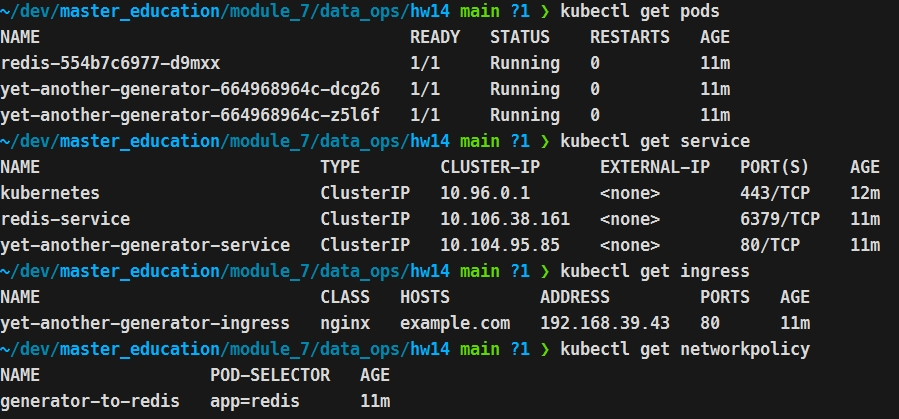

## Вариант 2
```
minikube start --vm-driver=kvm2 --memory=4096mb --cpus=4
minikube addons enable ingress
kubectl apply -f backend/deployment.yaml -f backend/service.yaml -f backend/ingress.yaml -f redis/deployment.yaml -f redis/service.yaml -f networkpolicy.yaml
```

