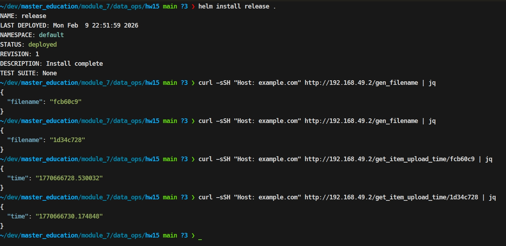
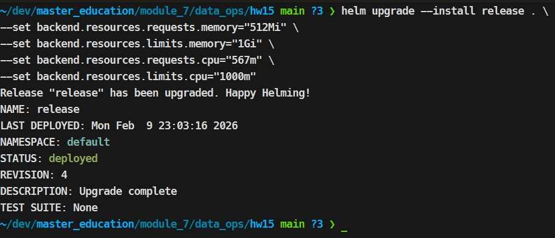
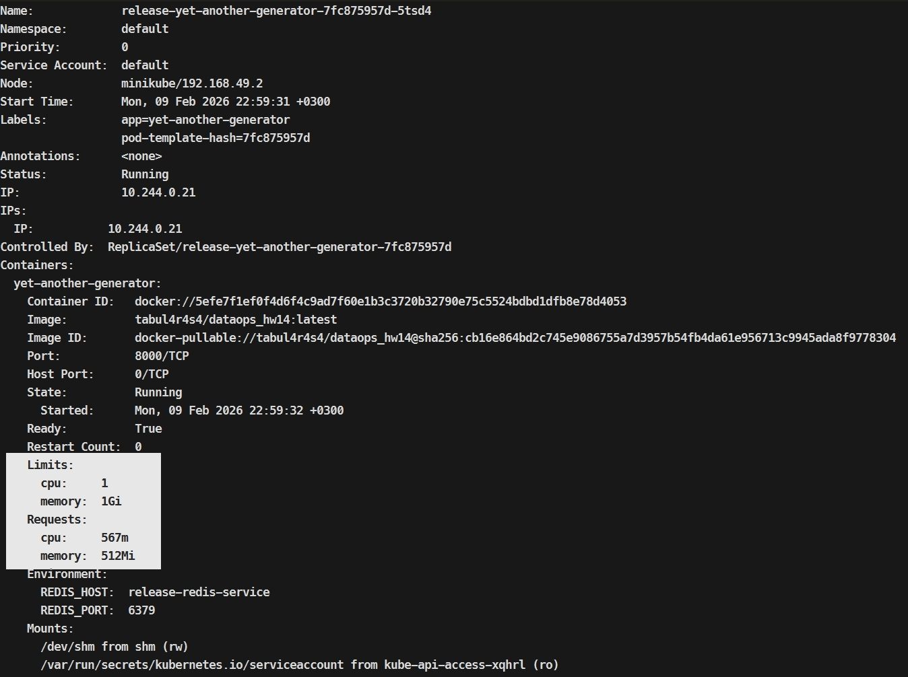
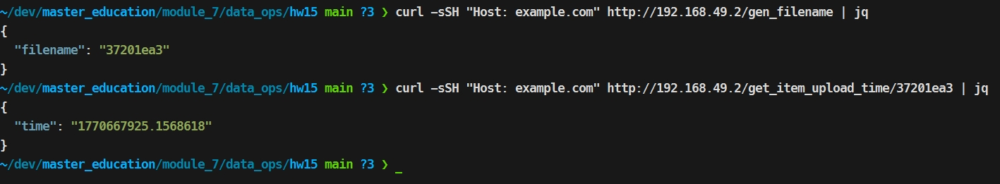
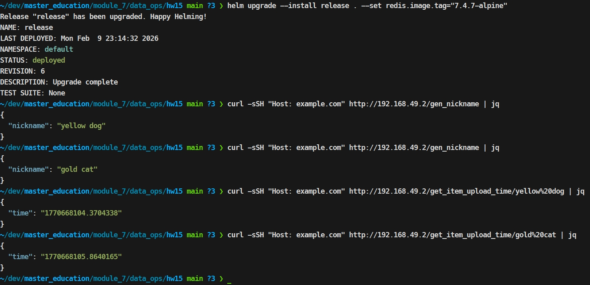

## Домашнее задание 15

### Развернем базовый вариант с помощью helm
```
helm install release .
```


### Вариант с лимитами по памяти/cpu
```
helm upgrade --install release . \
  --set backend.resources.requests.memory="512Mi" \
  --set backend.resources.limits.memory="1Gi" \
  --set backend.resources.requests.cpu="567m" \
  --set backend.resources.limits.cpu="1000m"
```




### Возьмем нестандартный образ
```
helm upgrade --install release . --set redis.image.tag="7.4.7-alpine"
```
